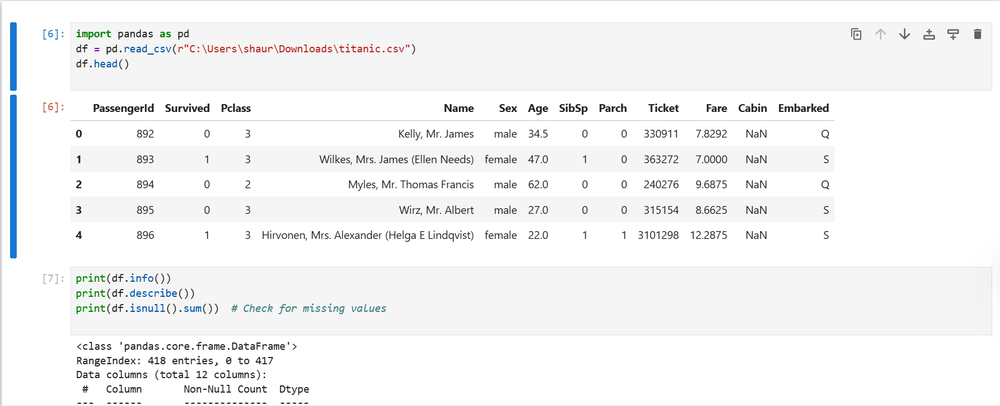
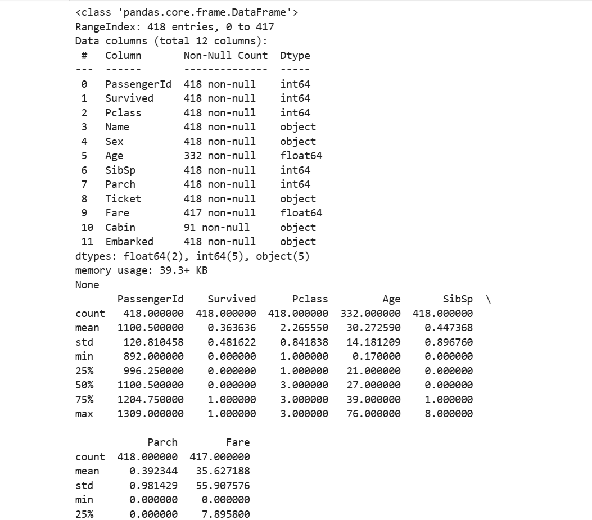
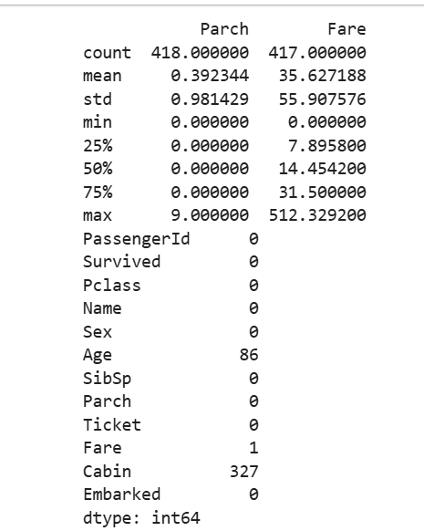
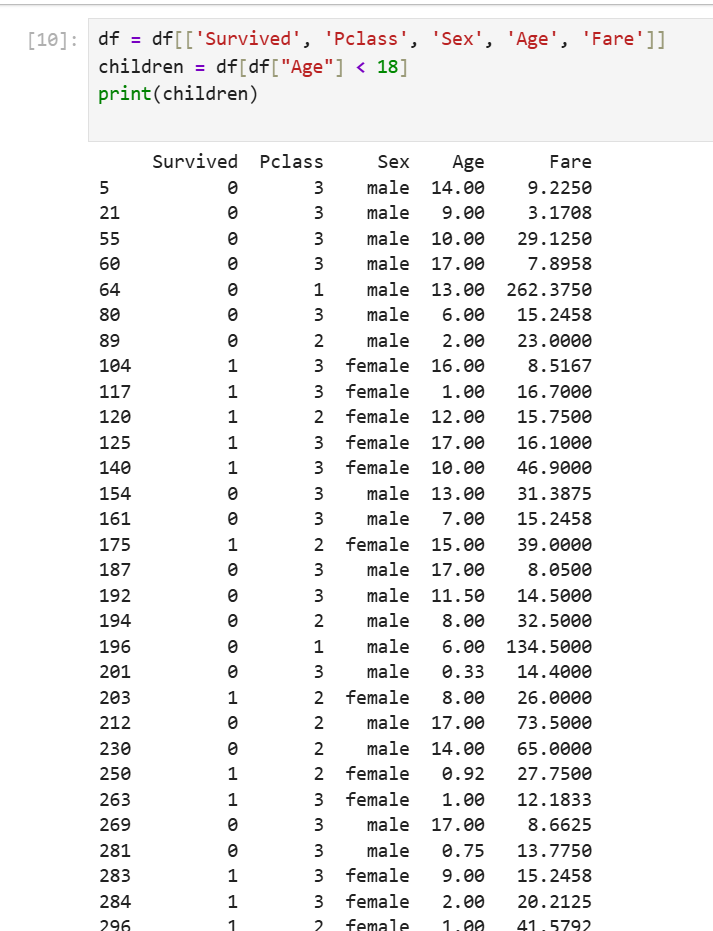
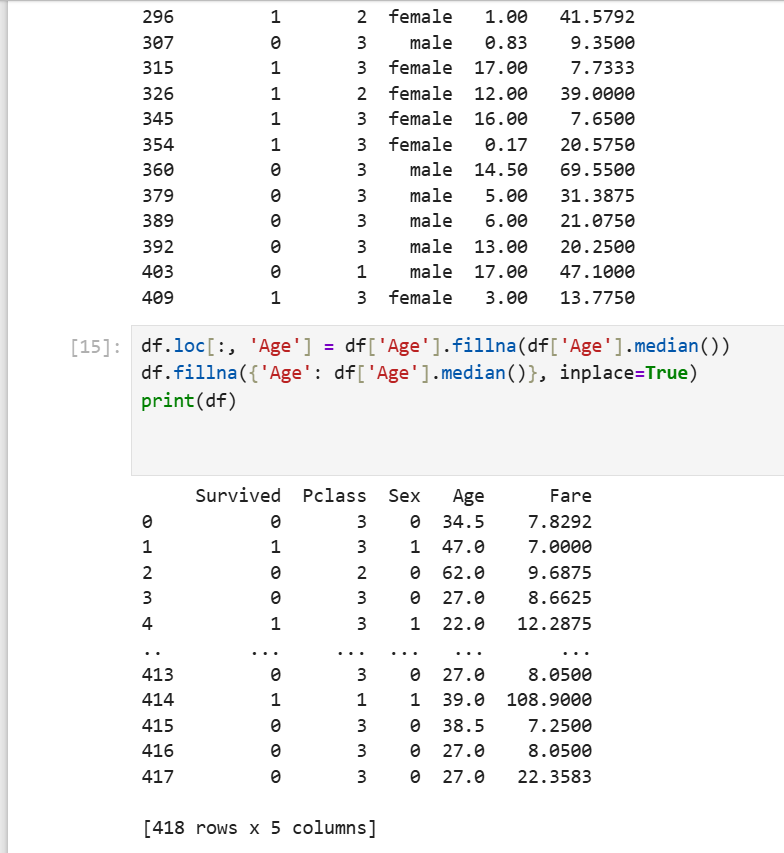

# 🚢 Titanic Data Analysis - SRMIST ACM SIGKDD R&D Task

Welcome to the Titanic Data Analysis project, built as part of the **SRMIST ACM SIGKDD Club R&D Division**. This mini-project walks through a foundational data science workflow using the iconic Titanic dataset — from loading and inspecting the data to filtering and handling missing values.

---

## 📁 Repository Contents

├── titanic_py/ # Contains 5 screenshots of outputs 
│ ├── output1.png 
│ ├── output2.png 
│ ├── output3.png 
│ ├── output4.png 
│ └── output5.png 
├── Titanic_ACM.ipynb # Main Jupyter Notebook 
├── titanic.csv # Titanic dataset used in the notebook 
└── README.md # This file 

---

## 🎯 Objective

Perform a step-by-step analysis on the Titanic dataset to practice:

- ✅ Data loading using pandas  
- ✅ Dataset inspection  
- ✅ Feature selection  
- ✅ Filtering based on conditions  
- ✅ Handling missing values effectively  

This project lays the groundwork for machine learning and data analysis workflows.

---

## 🔧 Tools & Libraries

- Python 3.x  
- Pandas  
- Jupyter Notebook  
- NumPy  
- (Optional) Matplotlib / Seaborn for visualization

---

## 🔍 What’s Inside the Notebook?

### 🗃️ 1. **Loading Data**
Using `pandas.read_csv()` to load `titanic.csv`.

### 🕵️‍♂️ 2. **Data Inspection**
- `.info()`, `.describe()`, `.head()`  
- Checking null values

### 🎯 3. **Feature Selection**
- Focus on columns like: `Survived`, `Pclass`, `Age`, `Sex`, `Fare`

### 🔎 4. **Filtering**
- Filtering passengers based on age/class
- Viewing survival trends by gender

### 🧹 5. **Handling Missing Data**
- Filling missing values in `Age` using `median`  
- Clean and safe assignment avoiding chained operations

---

## 🖼️ Output Screenshots

The folder [`titanic_py/`](./titanic_py/) contains five screenshots demonstrating output from each stage of the analysis. Here's a preview:

  
  
  
  

---

## 🚀 How to Run

1. Clone this repository or download the files manually.

2. Open `Titanic_ACM.ipynb` using Jupyter Notebook or VSCode.

3. Run each cell step by step to follow the entire Titanic data analysis process.

---

## 🧠 Learnings

By completing this project, you'll understand:

- How to load and examine datasets in Python  
- Data filtering & preprocessing techniques  
- Properly handling missing data  
- Laying a foundation for predictive modeling

---

Created by **Shaurya Kesarwani**  
🎓 SRMIST | ACM SIGKDD R&D Task  

---

